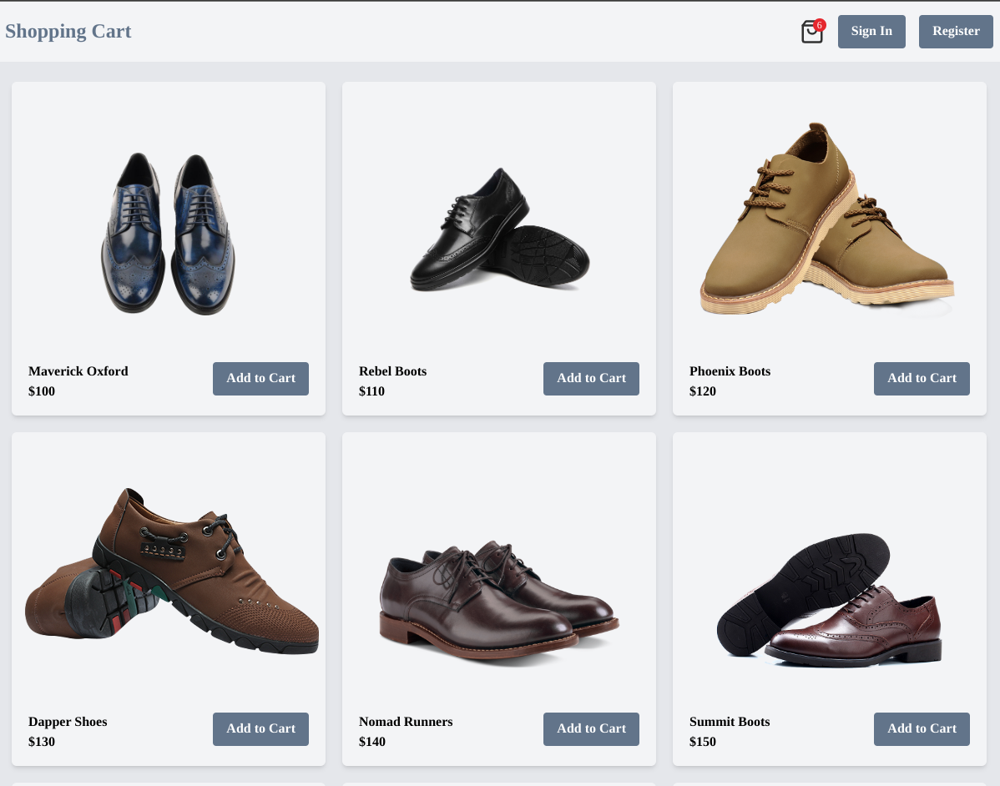
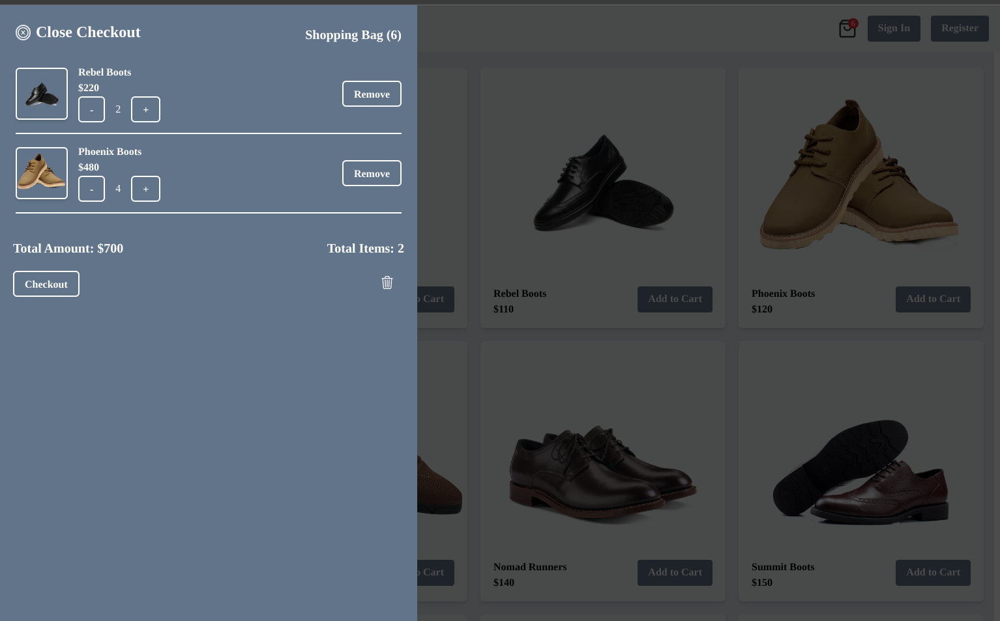
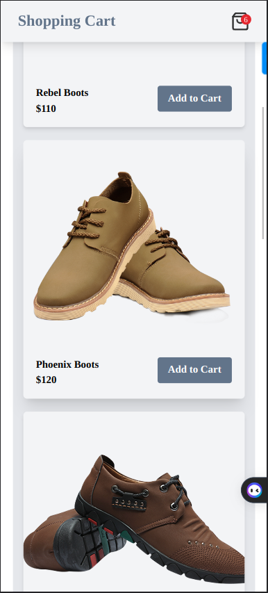
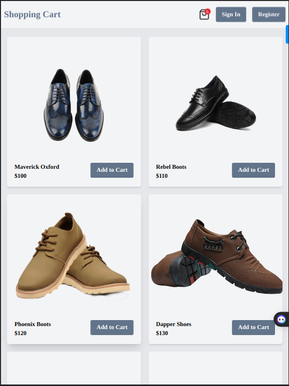

  <h3><b>React Cart App</b></h3>

<!-- TABLE OF CONTENTS -->

# 📗 Table of Contents

- [📗 Table of Contents](#-table-of-contents)
- [REACT CART APP ](#react-cart-app-)
  - [Screenshots of the APP](#screenshots-of-the-app)
  - [Design ](#design-)
  - [🛠 Built With ](#-built-with-)
    - [Tech Stack ](#tech-stack-)
    - [Live Server ](#live-server-)
  - [Key Features ](#key-features-)
  - [💻 Getting Started ](#-getting-started-)
    - [Prerequisites](#prerequisites)
    - [Setup](#setup)
    - [Install](#install)
    - [Run](#run)
  - [👥 Author ](#-author-)
  - [🔭 Future Features ](#-future-features-)
  - [🤝 Contributing ](#-contributing-)
  - [⭐️ Show your support ](#️-show-your-support-)
  - [🙏 Acknowledgments ](#-acknowledgments-)
  - [📝 License ](#-license-)

<!-- PROJECT DESCRIPTION -->

# REACT CART APP 

**CART SYSTEM**A cart system built using ReactJS, Tailwind CSS, TypeScript, and Redux Toolkit. It provides a seamless and user-friendly shopping experience. This system allows users to add, remove, and adjust quantities of items in their cart while dynamically updating the total price.

## Screenshots of the APP

## Design <a name="built-with">

## 🛠 Built With <a name="built-with">

  <ul>
      <li>REACTJS</li>
      <li>TypeScript</li>
      <li>Redux Toolkits</li>
      <li>TailwindCSS</li>
  </ul>
</a>

### Tech Stack 

  
Client

    <li><a href="https://github.com/kennedyowusu/shopping-cart-ts.git">FRONTEND</a><li>

<a href="#readme-top">front to top</a>

### Live Server <a name="live-server"><a>

[REACT CART SYSTEM](https://cart-system-ts.vercel.app/)

## Key Features 

- Created a react app
- Used redux toolkit to manage the state
- Used react hooks to manage the state
- Used typescript as the main language
- Used tailwindcss for the UI styling
<!-- GETTING STARTED -->

## 💻 Getting Started 

### Prerequisites

- Get started with [REACT](https://react.dev).
- Get started with [TYPESCRIPT](https://www.typescriptlang.org/docs/handbook/2/everyday-types.html).
- Get started with [TAILWINDCSS](https://tailwindcss.com/).
- Get started with [REDUX TOOLKIT](https://redux-toolkit.js.org/).

### Setup

- Clone this repository by running `git clone https://github.com/kennedyowusu/shopping-cart-ts.git` in your command line.

- Navigate to the repository by running `cd shopping-cart-ts`.

### Install

- Run `npm run install` to install all the packages.

### Run

- Run npm install
- Run npm dev
- In your browser, go to `http://localhost:5173`.

<a href="#readme-top">front to top</a>

## 👥 Author 

👤 **KENNEDY OWUSU**

- [GitHub](https://github.com/kennedyowusu)
- [Twitter](https://twitter.com/_iamkobby)
- [LinkedIn](www.linkedin.com/in/kennedy-owusu)

<a href="#readme-top">back to top</a>

<!-- FUTURE FEATURES -->

## 🔭 Future Features 

- [ ] **Implement Routing using React Router**
- [ ] **Connect to database**
- [ ] **Store data locally**

<a href="#readme-top">back to top</a>

<!-- CONTRIBUTING -->

## 🤝 Contributing 

Contributions, issues, and feature requests are welcome!

Feel free to check the [issues page](https://github.com/kennedyowusu/shopping-cart-ts.git/issues)

<a href="#readme-top">back to top</a>

<!-- SUPPORT -->

## ⭐️ Show your support 

Give a ⭐️ if you like this project!

<a href="#readme-top">back to top</a>

## 🙏 Acknowledgments 

- I would like to thank all code reviewers and coding partners for making this project better.

(<a href="#readme-top">back to top</a>)

<!-- LICENSE -->

## 📝 License 

This project is [MIT](./LICENSE) licensed.

<a href="#readme-top">back to top</a>

